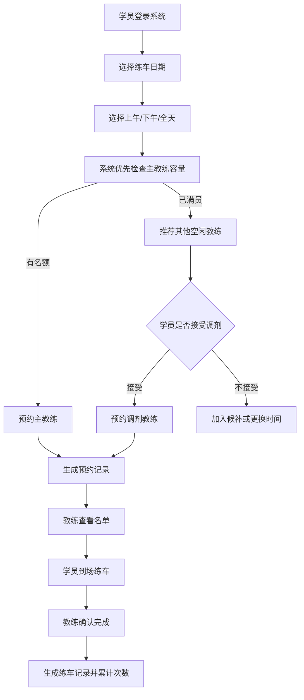

# 00 项目总览

## 1. 项目名称

驾校学员练车预约与调度管理系统

建议答辩名称：

> 基于教练资源均衡的驾校学员练车预约与调度管理系统

## 2. 项目背景

传统驾校练车预约常依赖电话沟通、微信群通知、微信群接龙等方式。该方式存在以下问题：

- 学员需要频繁联系教练，预约过程不透明；
- 教练人工统计学员练车意向，工作效率低；
- 同一天可能出现大量学员集中到场，导致每名学员实际练车时间不足；
- 另一时间段可能只有少数学员到场，造成教练与车辆资源闲置；
- 学员、教练、车辆、时间段之间缺少统一的信息化调度规则。

老师录音中明确强调：本系统重点管理驾校内部学生练车过程，不管理考试，不对接交管考试系统。系统核心价值是让练车预约过程更加智能化，让教练工作量更加均衡，让学员练车体验更好。

## 3. 项目目标

本系统以“练车预约”为核心，围绕学员、教练、车辆、排班、预约、调剂、练车记录等业务对象，建设一个可演示、可扩展、具备业务规则深度的驾校练车预约与调度平台。

核心目标：

1. 替代电话预约、微信群接龙等低效方式；
2. 支持学员查看可预约时间段并在线预约；
3. 支持教练每日容量限制，防止超员预约；
4. 支持主教练负责制；
5. 支持主教练满员后的临时调剂；
6. 支持车辆资源管理和车辆占用校验；
7. 支持教练工作量统计，体现资源均衡；
8. 支持练车完成确认和学员练车次数累计；
9. 为答辩展示提供清晰业务主线和亮点。

## 4. 项目范围

### 4.1 系统要做

| 范围 | 说明 |
|---|---|
| 学员管理 | 学员档案、所属教练、练车进度、预约记录 |
| 教练管理 | 教练档案、负责学员、每日容量、工作量统计 |
| 车辆管理 | 车辆档案、所属教练、车辆状态、使用记录 |
| 排班管理 | 管理教练某日某时间段是否可预约及容量 |
| 预约管理 | 学员按日期和半天时间段预约练车 |
| 调剂管理 | 主教练满员后临时安排到其他空闲教练 |
| 练车记录 | 教练确认到场、完成练车、记录训练内容 |
| 数据统计 | 每日预约人数、教练负载、学员练车次数 |

### 4.2 系统不做

| 不做内容 | 原因 |
|---|---|
| 考试预约 | 老师明确要求不管理考试 |
| 考试成绩 | 属于交管或考试系统范围 |
| 交管系统对接 | 不适合学生项目，且偏离核心 |
| 复杂缴费合同 | 非本项目核心矛盾 |
| 驾照办理全流程 | 范围过大，容易偏题 |
| 真实短信支付 | 可作为扩展，不作为核心功能 |

## 5. 用户角色

| 角色 | 说明 |
|---|---|
| 学员 | 查看可预约时间，预约练车，取消预约，查看练车记录 |
| 教练 | 查看负责学员，查看当天预约名单，确认到场，记录练车结果 |
| 管理员 | 管理学员、教练、车辆、排班、预约、调剂、统计数据 |

## 6. 核心业务主线

## 7. 项目亮点

1. **严格贴合老师要求**：聚焦练车，不做考试。
2. **业务规则清晰**：主教练、实际教练、调剂教练分离。
3. **具备真实场景价值**：解决电话预约和微信群接龙混乱问题。
4. **有资源调度思维**：考虑教练容量、车辆状态、时间段占用。
5. **有并发控制能力**：使用 Redis/Redisson 防止预约超额。
6. **有产品级体验**：预约看板、容量进度条、调剂推荐、数据统计。
7. **适合答辩展示**：业务痛点明确，演示链路完整。
