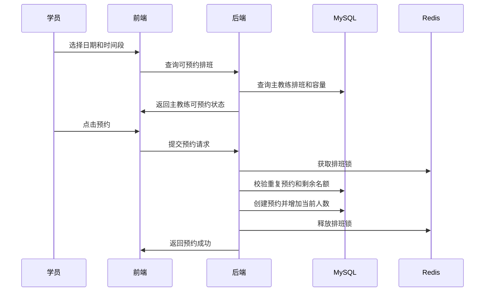
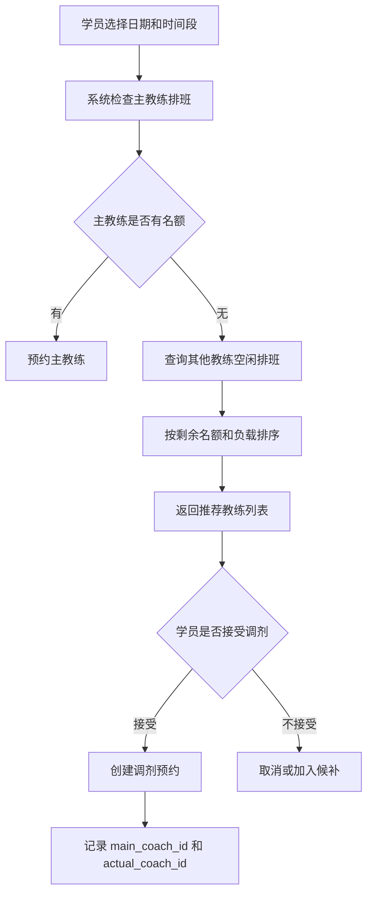
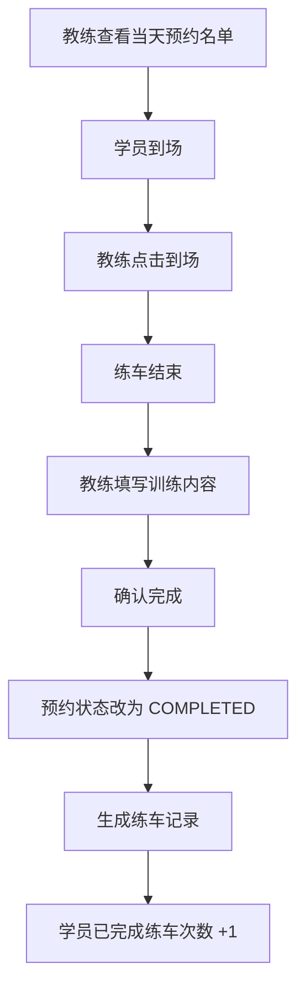

# 02 业务规则与流程设计

## 1. 核心业务对象

| 对象 | 说明 |
|---|---|
| 学员 | 预约练车的主体 |
| 主教练 | 学员长期归属的负责教练 |
| 实际教练 | 某一次预约实际带练的教练 |
| 车辆 | 练车所需资源 |
| 排班 | 某教练在某日期某时间段可带练的设置 |
| 预约 | 学员对某个排班的练车申请 |
| 练车记录 | 预约完成后的实际训练记录 |

## 2. 学员与教练关系规则

1. 一个教练可以负责多个学员；
2. 一个学员原则上只能有一个主教练；
3. 学员预约时优先预约主教练；
4. 主教练满员时，允许临时调剂到其他教练；
5. 调剂不改变学员的主教练归属；
6. 调剂预约中应同时记录主教练和实际教练。

## 3. 预约时间规则

系统采用半天粒度：

- 上午：MORNING；
- 下午：AFTERNOON；
- 全天：前端可展示为全天，后端拆分为上午和下午两条预约或两个时间段占用。

推荐实现：

> 后端只存 MORNING / AFTERNOON，避免全天带来的复杂冲突。前端“全天预约”只是批量提交两个半天预约。

## 4. 教练容量规则

每个教练每个时间段有最大预约人数。

示例：

| 教练 | 日期 | 时间段 | 最大人数 | 当前人数 | 剩余名额 |
|---|---|---|---|---|---|
| 唐国义 | 2026-05-16 | 上午 | 5 | 4 | 1 |
| 张三 | 2026-05-16 | 上午 | 5 | 2 | 3 |

预约成功时：

- current_students + 1；
- 预约取消时 current_students - 1；
- 并发场景下必须通过数据库条件更新或 Redis 锁防止超额。

## 5. 车辆占用规则

车辆可以设计为默认绑定教练，也可以由排班绑定。

推荐规则：

1. 一辆车同一时间段只能被一个教练排班使用；
2. 维修中车辆不能被排班绑定；
3. 停用车辆不能被预约；
4. 预约记录中保存实际使用车辆。

## 6. 正常预约流程



## 7. 调剂预约流程



## 8. 取消预约流程

规则：

1. 只能取消未开始且未完成的预约；
2. 可以设置开课前 12 小时内不可取消；
3. 取消后预约状态改为 CANCELLED；
4. 对应排班 current_students - 1；
5. 如果存在候补队列，可以通知候补学员。

## 9. 签到与完成流程



## 10. 状态设计

### 10.1 预约状态

| 状态 | 含义 |
|---|---|
| SUCCESS | 预约成功 |
| CANCELLED | 已取消 |
| COMPLETED | 已完成 |
| ABSENT | 爽约 |
| REJECTED | 被管理员取消或拒绝 |

### 10.2 排班状态

| 状态 | 含义 |
|---|---|
| OPEN | 可预约 |
| CLOSED | 停止预约 |
| FULL | 已满员 |
| CANCELLED | 排班取消 |

## 11. 调剂推荐规则

推荐其他教练时，可按以下权重排序：

```text
推荐分数 = 剩余名额 * 10 - 当日已预约人数 * 2 - 本周累计工作量
```

规则解释：

- 剩余名额越多，越优先；
- 当日已预约人数越少，越优先；
- 本周工作量越低，越优先；
- 这样体现“教练工作量均衡化”。

## 12. 业务异常处理

| 异常 | 系统处理 |
|---|---|
| 重复预约 | 提示该时间段已有预约 |
| 教练已满 | 提示可调剂教练 |
| 车辆维修 | 禁止预约 |
| 排班关闭 | 提示该时间段不可预约 |
| 并发抢最后名额 | 只允许一个成功，其余提示已满 |
| 学员爽约 | 标记 ABSENT，可影响后续预约优先级 |
