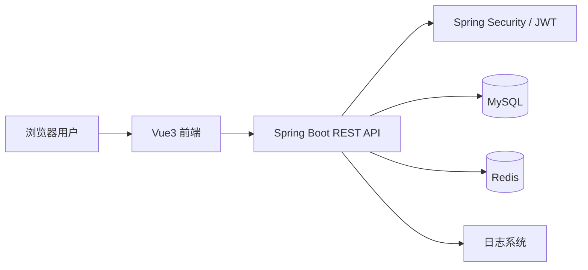

# 04 系统架构设计

## 1. 总体架构

系统采用前后端分离架构。



## 2. 技术选型

| 层级 | 技术 |
|---|---|
| 前端框架 | Vue 3 + Vite + TypeScript |
| 前端状态 | Pinia |
| 路由 | Vue Router |
| UI | Tailwind CSS + 自定义组件，或 Element Plus 二次设计 |
| 后端框架 | Spring Boot 3.x |
| 安全 | Spring Security + JWT |
| ORM | MyBatis-Plus |
| 数据库 | MySQL 8.x |
| 缓存与锁 | Redis 7.x + Redisson |
| 文档 | Markdown + Mermaid |
| 部署 | Docker Compose |

## 3. 后端分层

```text
controller  接口层：接收请求、参数校验、返回统一结果
service     业务层：处理预约、调剂、排班、统计等核心逻辑
mapper      数据访问层：MyBatis-Plus Mapper
entity      数据实体：数据库表映射
dto         请求对象：前端提交参数
vo          响应对象：返回给前端展示
config      配置类：安全、Redis、跨域等配置
common      通用类：统一响应、异常、枚举、工具类
```

## 4. 后端模块划分

| 模块 | 包名建议 | 说明 |
|---|---|---|
| 用户认证 | auth | 登录、JWT、权限 |
| 学员管理 | student | 学员档案、练车进度 |
| 教练管理 | coach | 教练档案、负责学员 |
| 车辆管理 | vehicle | 车辆状态、绑定 |
| 排班管理 | schedule | 教练排班、容量 |
| 预约管理 | reservation | 预约、取消、调剂 |
| 练车记录 | training | 到场、完成、记录 |
| 统计分析 | statistics | 首页看板和数据统计 |
| 系统管理 | system | 字典、日志、配置 |

## 5. 前端模块划分

```text
src/
  api/               接口封装
  assets/            静态资源
  components/        通用组件
  components/business/ 业务组件
  router/            路由配置
  stores/            Pinia 状态
  views/
    auth/            登录页
    student/         学员端页面
    coach/           教练端页面
    admin/           管理端页面
  types/             TypeScript 类型
  utils/             工具函数
  styles/            全局样式
```

## 6. 关键业务服务

### 6.1 ReservationService

职责：

- 查询可预约排班；
- 创建预约；
- 取消预约；
- 调剂预约；
- 校验重复预约；
- 控制容量；
- 处理 Redis 锁。

### 6.2 ScheduleService

职责：

- 创建排班；
- 批量生成排班；
- 修改容量；
- 开启/关闭排班；
- 查询剩余名额。

### 6.3 TrainingRecordService

职责：

- 教练确认到场；
- 完成练车；
- 生成练车记录；
- 累计学员练车次数。

### 6.4 StatisticsService

职责：

- 统计教练工作量；
- 统计每日预约趋势；
- 统计调剂次数；
- 统计车辆利用率。

## 7. 推荐包结构

```text
com.drivingschool
  DrivingSchoolApplication.java
  common
    result
    exception
    enums
    utils
  config
    SecurityConfig.java
    RedisConfig.java
    CorsConfig.java
  auth
    controller
    service
    dto
    vo
  student
    controller
    service
    mapper
    entity
    dto
    vo
  coach
  vehicle
  schedule
  reservation
  training
  statistics
```

## 8. 统一响应格式

```json
{
  "code": 200,
  "message": "操作成功",
  "data": {}
}
```

## 9. 异常处理

建议定义全局异常：

| 异常 | 含义 |
|---|---|
| BusinessException | 业务异常 |
| UnauthorizedException | 未登录 |
| ForbiddenException | 无权限 |
| NotFoundException | 数据不存在 |
| ReservationFullException | 排班已满 |
| DuplicateReservationException | 重复预约 |

## 10. 架构关键点

1. MySQL 存储主业务数据；
2. Redis 不作为主库，只用于缓存、锁、队列、限流；
3. 预约创建必须使用事务；
4. 预约并发必须防止超额；
5. 前端必须根据角色显示不同路由；
6. 代码必须写中文注释，尤其是预约调剂核心逻辑。
