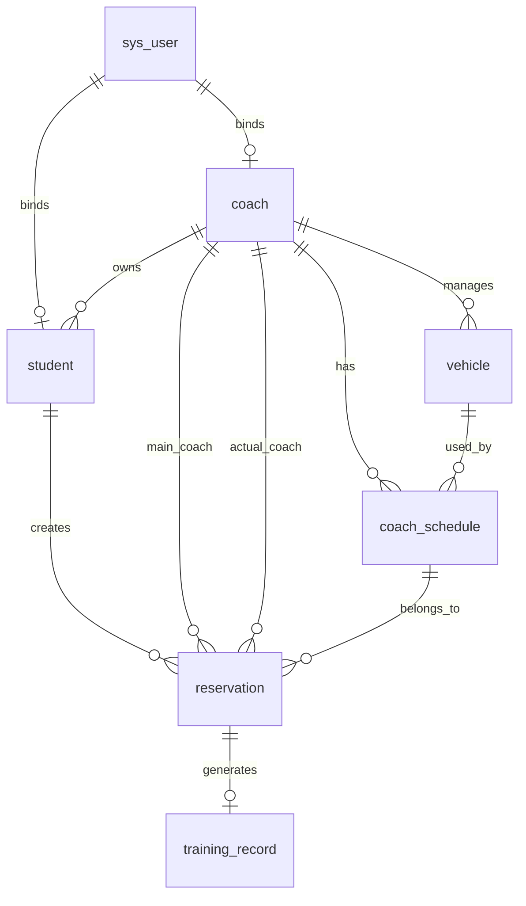

# 05 数据库设计

## 1. 数据库命名

数据库名：

```sql
CREATE DATABASE IF NOT EXISTS driving_school_schedule DEFAULT CHARACTER SET utf8mb4 COLLATE utf8mb4_general_ci;
USE driving_school_schedule;
```

字符集：`utf8mb4`

## 2. ER 图



## 3. 表清单

| 表名 | 中文名 | 说明 |
|---|---|---|
| sys_user | 系统用户表 | 登录账号与角色 |
| student | 学员表 | 学员档案与主教练 |
| coach | 教练表 | 教练档案与容量 |
| vehicle | 车辆表 | 教练车档案与状态 |
| coach_schedule | 教练排班表 | 某日某时间段容量 |
| reservation | 预约表 | 学员练车预约记录 |
| training_record | 练车记录表 | 实际完成练车记录 |
| operation_log | 操作日志表 | 重要操作审计 |

## 4. 建表 SQL

### 4.1 系统用户表

```sql
CREATE TABLE sys_user (
    id BIGINT PRIMARY KEY AUTO_INCREMENT COMMENT '用户ID',
    username VARCHAR(50) NOT NULL UNIQUE COMMENT '登录账号',
    password VARCHAR(100) NOT NULL COMMENT '加密后的密码',
    role VARCHAR(20) NOT NULL COMMENT '角色：ADMIN/COACH/STUDENT',
    related_id BIGINT NULL COMMENT '关联业务ID，如学员ID或教练ID',
    status VARCHAR(20) NOT NULL DEFAULT 'ENABLE' COMMENT '状态：ENABLE/DISABLE',
    create_time DATETIME NOT NULL DEFAULT CURRENT_TIMESTAMP COMMENT '创建时间',
    update_time DATETIME NOT NULL DEFAULT CURRENT_TIMESTAMP ON UPDATE CURRENT_TIMESTAMP COMMENT '更新时间'
) COMMENT='系统用户表';
```

### 4.2 学员表

```sql
CREATE TABLE student (
    id BIGINT PRIMARY KEY AUTO_INCREMENT COMMENT '学员ID',
    name VARCHAR(50) NOT NULL COMMENT '学员姓名',
    phone VARCHAR(20) NOT NULL COMMENT '手机号',
    gender VARCHAR(10) COMMENT '性别',
    main_coach_id BIGINT NOT NULL COMMENT '主教练ID',
    subject_type VARCHAR(20) NOT NULL DEFAULT 'SUBJECT_2' COMMENT '训练科目：SUBJECT_2/SUBJECT_3',
    required_training_count INT NOT NULL DEFAULT 8 COMMENT '应完成练车次数',
    completed_training_count INT NOT NULL DEFAULT 0 COMMENT '已完成练车次数',
    status VARCHAR(20) NOT NULL DEFAULT 'NORMAL' COMMENT '状态：NORMAL/STOPPED',
    remark VARCHAR(255) COMMENT '备注',
    create_time DATETIME NOT NULL DEFAULT CURRENT_TIMESTAMP COMMENT '创建时间',
    update_time DATETIME NOT NULL DEFAULT CURRENT_TIMESTAMP ON UPDATE CURRENT_TIMESTAMP COMMENT '更新时间',
    INDEX idx_student_main_coach (main_coach_id),
    INDEX idx_student_phone (phone)
) COMMENT='学员表';
```

### 4.3 教练表

```sql
CREATE TABLE coach (
    id BIGINT PRIMARY KEY AUTO_INCREMENT COMMENT '教练ID',
    name VARCHAR(50) NOT NULL COMMENT '教练姓名',
    phone VARCHAR(20) NOT NULL COMMENT '手机号',
    license_no VARCHAR(50) COMMENT '教练证号',
    max_students_per_half_day INT NOT NULL DEFAULT 5 COMMENT '默认每半天最多带练人数',
    status VARCHAR(20) NOT NULL DEFAULT 'NORMAL' COMMENT '状态：NORMAL/LEAVE/STOPPED',
    remark VARCHAR(255) COMMENT '备注',
    create_time DATETIME NOT NULL DEFAULT CURRENT_TIMESTAMP COMMENT '创建时间',
    update_time DATETIME NOT NULL DEFAULT CURRENT_TIMESTAMP ON UPDATE CURRENT_TIMESTAMP COMMENT '更新时间',
    INDEX idx_coach_phone (phone)
) COMMENT='教练表';
```

### 4.4 车辆表

```sql
CREATE TABLE vehicle (
    id BIGINT PRIMARY KEY AUTO_INCREMENT COMMENT '车辆ID',
    plate_number VARCHAR(20) NOT NULL UNIQUE COMMENT '车牌号',
    coach_id BIGINT NULL COMMENT '默认绑定教练ID',
    vehicle_type VARCHAR(20) NOT NULL DEFAULT 'C1' COMMENT '车型',
    status VARCHAR(20) NOT NULL DEFAULT 'NORMAL' COMMENT '状态：NORMAL/MAINTENANCE/STOPPED',
    remark VARCHAR(255) COMMENT '备注',
    create_time DATETIME NOT NULL DEFAULT CURRENT_TIMESTAMP COMMENT '创建时间',
    update_time DATETIME NOT NULL DEFAULT CURRENT_TIMESTAMP ON UPDATE CURRENT_TIMESTAMP COMMENT '更新时间',
    INDEX idx_vehicle_coach (coach_id),
    INDEX idx_vehicle_status (status)
) COMMENT='车辆表';
```

### 4.5 教练排班表

```sql
CREATE TABLE coach_schedule (
    id BIGINT PRIMARY KEY AUTO_INCREMENT COMMENT '排班ID',
    coach_id BIGINT NOT NULL COMMENT '教练ID',
    vehicle_id BIGINT NULL COMMENT '绑定车辆ID',
    schedule_date DATE NOT NULL COMMENT '排班日期',
    time_slot VARCHAR(20) NOT NULL COMMENT '时间段：MORNING/AFTERNOON',
    max_students INT NOT NULL COMMENT '最大预约人数',
    current_students INT NOT NULL DEFAULT 0 COMMENT '当前已预约人数',
    status VARCHAR(20) NOT NULL DEFAULT 'OPEN' COMMENT '状态：OPEN/CLOSED/CANCELLED',
    remark VARCHAR(255) COMMENT '备注',
    create_time DATETIME NOT NULL DEFAULT CURRENT_TIMESTAMP COMMENT '创建时间',
    update_time DATETIME NOT NULL DEFAULT CURRENT_TIMESTAMP ON UPDATE CURRENT_TIMESTAMP COMMENT '更新时间',
    UNIQUE KEY uk_coach_date_slot (coach_id, schedule_date, time_slot),
    INDEX idx_schedule_date_slot (schedule_date, time_slot),
    INDEX idx_schedule_vehicle (vehicle_id)
) COMMENT='教练排班表';
```

### 4.6 预约表

```sql
CREATE TABLE reservation (
    id BIGINT PRIMARY KEY AUTO_INCREMENT COMMENT '预约ID',
    student_id BIGINT NOT NULL COMMENT '学员ID',
    main_coach_id BIGINT NOT NULL COMMENT '学员主教练ID',
    actual_coach_id BIGINT NOT NULL COMMENT '本次实际带练教练ID',
    vehicle_id BIGINT NULL COMMENT '本次预约车辆ID',
    schedule_id BIGINT NOT NULL COMMENT '排班ID',
    reservation_date DATE NOT NULL COMMENT '预约日期',
    time_slot VARCHAR(20) NOT NULL COMMENT '时间段：MORNING/AFTERNOON',
    status VARCHAR(20) NOT NULL DEFAULT 'SUCCESS' COMMENT '状态：SUCCESS/CANCELLED/COMPLETED/ABSENT',
    is_adjusted TINYINT NOT NULL DEFAULT 0 COMMENT '是否调剂：0否，1是',
    adjust_reason VARCHAR(255) COMMENT '调剂原因',
    cancel_reason VARCHAR(255) COMMENT '取消原因',
    create_time DATETIME NOT NULL DEFAULT CURRENT_TIMESTAMP COMMENT '创建时间',
    cancel_time DATETIME NULL COMMENT '取消时间',
    update_time DATETIME NOT NULL DEFAULT CURRENT_TIMESTAMP ON UPDATE CURRENT_TIMESTAMP COMMENT '更新时间',
    INDEX idx_reservation_student_date (student_id, reservation_date),
    INDEX idx_reservation_schedule (schedule_id),
    INDEX idx_reservation_actual_coach (actual_coach_id, reservation_date),
    INDEX idx_reservation_status (status)
) COMMENT='预约表';
```

### 4.7 练车记录表

```sql
CREATE TABLE training_record (
    id BIGINT PRIMARY KEY AUTO_INCREMENT COMMENT '练车记录ID',
    reservation_id BIGINT NOT NULL COMMENT '预约ID',
    student_id BIGINT NOT NULL COMMENT '学员ID',
    coach_id BIGINT NOT NULL COMMENT '实际带练教练ID',
    vehicle_id BIGINT NULL COMMENT '车辆ID',
    training_date DATE NOT NULL COMMENT '练车日期',
    time_slot VARCHAR(20) NOT NULL COMMENT '时间段',
    training_content VARCHAR(500) COMMENT '训练内容',
    result VARCHAR(20) NOT NULL DEFAULT 'COMPLETED' COMMENT '结果：COMPLETED/ABSENT',
    coach_comment VARCHAR(500) COMMENT '教练备注',
    create_time DATETIME NOT NULL DEFAULT CURRENT_TIMESTAMP COMMENT '创建时间',
    INDEX idx_training_student (student_id),
    INDEX idx_training_coach_date (coach_id, training_date)
) COMMENT='练车记录表';
```

### 4.8 操作日志表

```sql
CREATE TABLE operation_log (
    id BIGINT PRIMARY KEY AUTO_INCREMENT COMMENT '日志ID',
    user_id BIGINT COMMENT '操作用户ID',
    username VARCHAR(50) COMMENT '操作账号',
    operation_type VARCHAR(50) COMMENT '操作类型',
    business_type VARCHAR(50) COMMENT '业务类型',
    content VARCHAR(1000) COMMENT '操作内容',
    ip VARCHAR(50) COMMENT 'IP地址',
    create_time DATETIME NOT NULL DEFAULT CURRENT_TIMESTAMP COMMENT '创建时间',
    INDEX idx_log_user (user_id),
    INDEX idx_log_time (create_time)
) COMMENT='操作日志表';
```

## 5. 关键索引说明

| 索引 | 目的 |
|---|---|
| uk_coach_date_slot | 防止同一教练同一日期同一时间段重复排班 |
| idx_reservation_student_date | 快速查询学员某日预约，防重复预约 |
| idx_reservation_schedule | 快速查询某排班预约人数 |
| idx_schedule_date_slot | 快速查询某日期某时间段可预约排班 |
| idx_training_coach_date | 统计教练工作量 |

## 6. 并发更新建议

预约时，除了 Redis 锁，还可以使用数据库条件更新兜底：

```sql
UPDATE coach_schedule
SET current_students = current_students + 1
WHERE id = #{scheduleId}
  AND current_students < max_students
  AND status = 'OPEN';
```

如果影响行数为 0，说明已经满员或排班不可预约。

## 7. 字段设计重点

### main_coach_id 与 actual_coach_id

预约表同时保存：

- main_coach_id：学员归属教练；
- actual_coach_id：本次实际带练教练。

这样可以体现：

- 主教练负责制；
- 临时调剂不改变学员归属；
- 后续可统计调剂次数。
