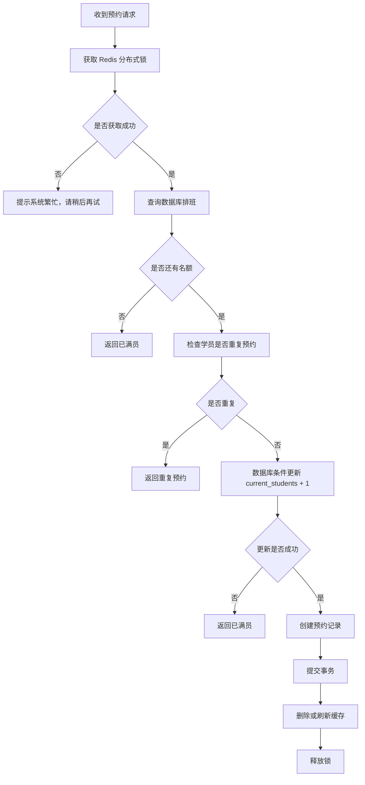

# 08 Redis 缓存与并发预约设计

## 1. Redis 使用原则

Redis 可以使用，但不能代替 MySQL 存储核心业务数据。

本项目中：

- MySQL 是主数据源；
- Redis 是辅助系统；
- Redis 主要用于缓存、分布式锁、防止预约超额、限流、候补队列。

## 2. Redis 使用场景

| 场景 | 是否推荐 | 说明 |
|---|---|---|
| 可预约排班缓存 | 推荐 | 减少高频查询数据库 |
| 预约分布式锁 | 强烈推荐 | 防止最后一个名额被多人抢到 |
| 登录 Token 黑名单 | 可选 | 退出登录时使用 |
| 接口限流 | 推荐 | 防止重复点击 |
| 候补队列 | 加分项 | 排班满员后排队 |
| 学员/教练主数据 | 不推荐 | 应以 MySQL 为准 |

## 3. Redis Key 设计

| Key | 类型 | 说明 |
|---|---|---|
| schedule:available:{date}:{slot} | String/Hash | 可预约排班缓存 |
| lock:schedule:{scheduleId} | Lock | 排班预约锁 |
| limit:reservation:{studentId} | String | 学员预约频率限制 |
| waiting:schedule:{scheduleId} | List/ZSet | 候补队列 |
| token:blacklist:{tokenId} | String | Token 黑名单 |

## 4. 预约锁设计

使用 Redisson：

```java
RLock lock = redissonClient.getLock("lock:schedule:" + scheduleId);
```

建议：

- 等待锁时间：3 秒；
- 自动释放时间：10 秒；
- finally 中必须释放锁；
- 锁内必须再次查询数据库，不能只依赖前端或缓存。

## 5. 防超额预约流程



## 6. 推荐后端伪代码

```java
/**
 * 创建练车预约
 * 中文注释要求：
 * 1. 说明为什么要加 Redis 锁；
 * 2. 说明为什么锁内还要重新查数据库；
 * 3. 说明数据库条件更新是最终兜底。
 */
@Transactional(rollbackFor = Exception.class)
public ReservationVO createReservation(Long scheduleId, Long currentStudentId) {
    String lockKey = "lock:schedule:" + scheduleId;
    RLock lock = redissonClient.getLock(lockKey);

    boolean locked = false;
    try {
        locked = lock.tryLock(3, 10, TimeUnit.SECONDS);
        if (!locked) {
            throw new BusinessException("当前预约人数较多，请稍后重试");
        }

        // 加锁后重新查询排班，避免使用过期缓存导致超额预约
        CoachSchedule schedule = scheduleMapper.selectById(scheduleId);
        if (schedule == null || !"OPEN".equals(schedule.getStatus())) {
            throw new BusinessException("该时间段不可预约");
        }

        if (schedule.getCurrentStudents() >= schedule.getMaxStudents()) {
            throw new BusinessException("该时间段已满员");
        }

        // 校验学员同一时间段是否已有有效预约
        boolean duplicated = reservationMapper.existsActiveReservation(
            currentStudentId,
            schedule.getScheduleDate(),
            schedule.getTimeSlot()
        );
        if (duplicated) {
            throw new BusinessException("你已预约该时间段，不能重复预约");
        }

        // 数据库条件更新作为最终兜底，确保并发下不会超额
        int updated = scheduleMapper.increaseCurrentStudents(scheduleId);
        if (updated == 0) {
            throw new BusinessException("该时间段刚刚已被约满");
        }

        // 创建预约记录
        Reservation reservation = buildReservation(schedule, currentStudentId);
        reservationMapper.insert(reservation);

        return buildReservationVO(reservation);
    } catch (InterruptedException e) {
        Thread.currentThread().interrupt();
        throw new BusinessException("预约处理中断，请稍后重试");
    } finally {
        if (locked && lock.isHeldByCurrentThread()) {
            lock.unlock();
        }
    }
}
```

## 7. 缓存更新策略

预约成功、取消预约、管理员修改排班后，应删除相关缓存。

推荐：

```text
先更新数据库，再删除缓存
```

不建议在学生项目中过度实现复杂缓存一致性。

## 8. 候补队列设计

加分项，不是必须。

当排班满员后，学员可以加入候补队列。

Redis ZSet：

```text
waiting:schedule:{scheduleId}
score = 当前时间戳
value = studentId
```

当有人取消预约：

1. 释放名额；
2. 查询候补队列第一个学员；
3. 生成候补提醒；
4. 或自动预约，视业务规则决定。

建议学生项目只做“候补名单”，不做真实通知。

## 9. 频率限制

防止学员重复点击预约按钮：

```text
limit:reservation:{studentId}
```

规则：

- 提交预约时 set key，过期 5 秒；
- 5 秒内重复提交则拒绝。

## 10. 结论

Redis 应该用于提升系统可靠性和并发安全，而不是为了“技术堆砌”。

本项目最适合展示 Redis 的点是：

> 使用 Redis 分布式锁 + 数据库条件更新，保证同一排班在高并发预约时不会超过最大人数。
